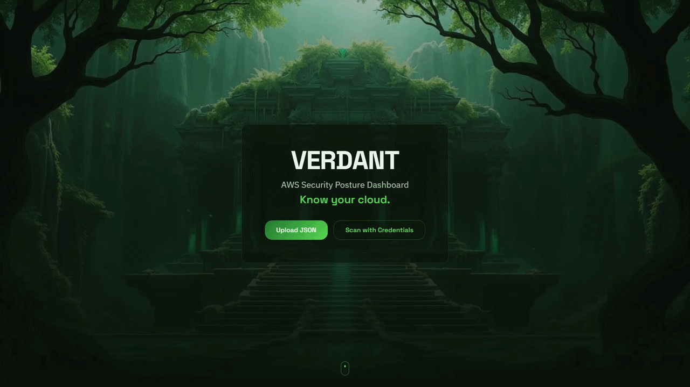

# Verdant

**Live:** [verdant.nfroze.co.uk](https://verdant.nfroze.co.uk)

A lightweight AWS security posture dashboard that evaluates cloud environments against the CIS AWS Foundations Benchmark - running 16 severity-weighted compliance checks in under 60 seconds without requiring Security Hub, Prowler, or commercial tooling.

## Overview

Most small teams and solo developers run zero security tooling against their AWS accounts. Security Hub requires AWS Config (which costs per rule evaluation), Prowler needs a dedicated EC2 instance or container, and commercial CSPM platforms start at five figures annually. The result is that smaller environments - often the most vulnerable - get no compliance visibility at all.

Verdant fills that gap with two operational modes. The recommended path is fully offline: a bash script runs 15 AWS CLI commands locally, outputs a JSON snapshot, and the browser evaluates all 16 CIS checks client-side. Credentials never leave the user's machine. The alternative online mode accepts temporary credentials via a Lambda that holds them only in memory during execution - never stored, logged, or persisted.

The 16 checks span five categories (IAM, Logging, Monitoring, Networking, Storage) and use severity-weighted scoring rather than flat pass/fail. A critical failure like open SSH to 0.0.0.0/0 carries 15 points; a medium finding like missing S3 versioning carries 5. This means the score reflects actual security risk, not just a count of findings. Historical scans are tracked via browser-generated session tokens, with a trend chart showing posture changes over time.

## Architecture

The offline path keeps everything client-side. The bash script runs 15 AWS CLI commands across IAM, S3, S3Control, CloudTrail, and EC2, producing a JSON snapshot that 16 TypeScript evaluator functions process in the browser. Each evaluator returns pass, fail, or warning with specific evidence - for example, the SSH check scans every security group's ingress rules for port 22 open to 0.0.0.0/0 or ::/0, including protocol -1 (all traffic) catch-alls.

The online path adds two Lambda functions behind an API Gateway HTTP API. The scan Lambda (256 MB, 30s timeout) creates a temporary boto3 session from the provided credentials and runs the same 15 API calls server-side. The history Lambda (128 MB, 10s timeout) persists results to DynamoDB with the session token as partition key and timestamp as range key, enabling per-session trend queries.

The scan Lambda's execution role has zero permissions to any resource it evaluates - only CloudWatch Logs access via AWSLambdaBasicExecutionRole. Security comes from the bring-your-own-credentials model - if the function is compromised, the attacker can write logs but cannot read an S3 bucket, list an IAM user, or describe a security group.

## Tech Stack

**Frontend**: React 19, TypeScript, Vite 7, Tailwind CSS v4, Framer Motion, Recharts, Lucide icons, Vitest

**Backend**: AWS Lambda (Python 3.12, boto3) - scan (256 MB, 30s) + history (128 MB, 10s)

**Data**: DynamoDB (on-demand, sessionToken + timestamp keys)

**Infrastructure**: API Gateway HTTP API, S3 (static hosting), Cloudflare (DNS, SSL), Terraform, eu-west-2

**Tooling**: Bash script (15 AWS CLI commands for offline mode), Vitest (36 unit tests for evaluators)

## Key Decisions

- **Offline-first architecture**: The recommended path runs entirely client-side with zero credential transmission. This eliminates the trust question entirely - users don't need to evaluate whether the tool is safe to give credentials to, because it never asks for them in the default flow.

- **Zero-permission scan Lambda**: The function's IAM role has no permissions to any resource it evaluates - only CloudWatch Logs. It operates exclusively with the user's provided credentials via a temporary boto3 session. If compromised, the attacker gains CloudWatch log access and nothing else.

- **Severity-weighted scoring over pass/fail counting**: Treating all checks equally makes a missing S3 versioning setting (low operational risk) equivalent to SSH open to the internet (critical exposure). Weighting critical checks at 15 points and medium checks at 5 points produces scores that reflect actual security posture.

- **Session tokens without authentication**: Browser-generated UUIDs stored in localStorage provide scan history tracking without an authentication layer. Acceptable for a free tool with non-sensitive aggregate data - the trade-off is that anyone with the token can read the history, but there's nothing exploitable in compliance scores.

## Author

**Noah Frost**

- Website: [noahfrost.co.uk](https://noahfrost.co.uk)
- GitHub: [github.com/nfroze](https://github.com/nfroze)
- LinkedIn: [linkedin.com/in/nfroze](https://linkedin.com/in/nfroze)
